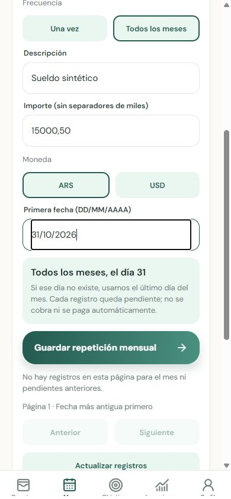
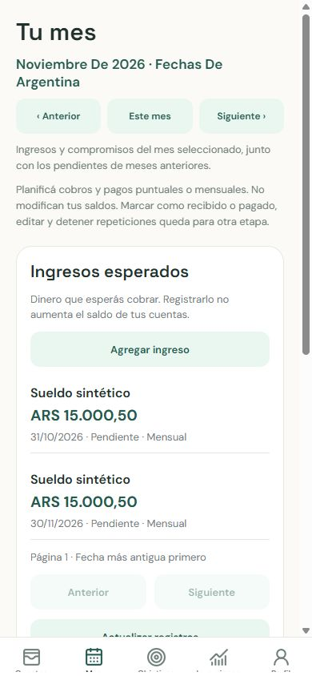

# Monthly planning and mobile 404 validation

Validated on 2026-10-01 using synthetic fixtures only.

## Delivered behavior

- One-time or monthly planned ARS/USD income and commitments.
- Chosen first date; no earlier occurrences. Missing monthly days use month end
  without changing the original anchor day.
- Owned templates, atomic creation, unique template/month instances, PostgreSQL
  row locks and conflict-safe batched generation. Elapsed pending months survive
  inactivity; future selected months are generated individually.
- Mobile frequency selection, DD/MM/YYYY dates, repetition explanation, monthly
  labels and month navigation. Planning never changes balances or snapshots.
- Docker starts with Alembic migrations. The stale image behind the phone's
  API URL was rebuilt; monthly migration 50d9fbc3f669 is applied.

## Verification

- Backend: 172 tests passed; 97% branch-inclusive coverage. Ruff lint and format,
  mypy (53 source files) passed. Includes leap years, day 31, year limits,
  positive/exact decimals, ownership, duplicate prevention, concurrent requests,
  pagination and 562 months of history across insertion batches.
- Mobile: 20 tests passed; Expo lint and TypeScript passed.
- Docker LAN API: /ready returns ready; OpenAPI includes ONE_TIME/MONTHLY;
  unauthenticated /api/v1/income returns 401 rather than 404. Alembic is at head
  and check reports no missing schema operations.
- Browser at 390 × 844: created synthetic monthly income and rent, navigated to
  November, confirmed 31 October becomes 30 November, and reloaded to verify
  persisted records/session. Test user and its records removed from the named
  test database. Temporary preview and test API stopped; Docker remains running.

## Limits

Native Expo Go was not operated on a physical phone in this validation.
Editing/stopping repetitions and received/paid status transitions remain future
work; the screen discloses these limits. A retried ambiguous POST can create a
second template, so refresh before retrying. No budgets or availability metrics
are implemented. Existing Node module-type warnings and a Windows pytest cache
permission warning did not fail validation.
