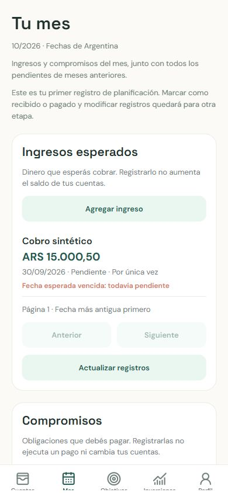
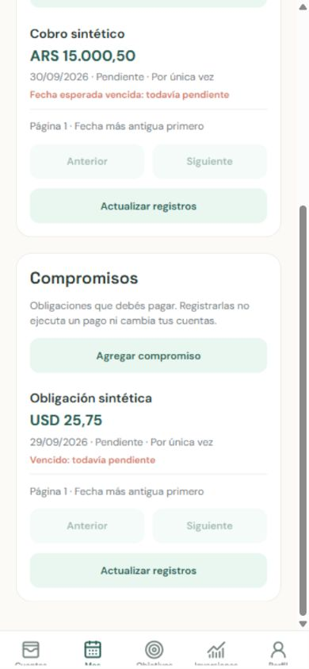

# First part of M3 — validation record

Validated locally on 2026-10-01 with synthetic data only.

## Delivered scope

Create and consult one-time planned income and commitments through authenticated
API endpoints and Tu mes. Positive ARS/USD amounts remain exact decimal strings
at the mobile boundary and `Decimal` / `NUMERIC(20,2)` in backend and PostgreSQL.
Past, present, and future calendar dates are accepted. Month listing includes
older pending records and uses deterministic date/UUID ordering with pagination.
Account balances and history are unchanged. M2 and M3 remain partial.

## Automated checks

Against the existing local `financial_plan_test` PostgreSQL database:

- `uv run alembic upgrade head`: passed; additive revision `2921b44cad5b`.
- `uv run pytest --cov=app --cov-report=term-missing`: 150 passed, 97% global
  coverage. A Windows permission warning prevented writing pytest's cache;
  test execution and coverage completed successfully.
- `uv run ruff format --check .`: passed.
- `uv run ruff check .`: passed.
- `uv run mypy .`: passed.
- `uv run alembic current --check-heads`: passed.
- `uv run alembic check`: passed; no pending model/schema differences.

From mobile:

- `npm test`: 19 passed, including exact-money/date validation and planning API
  authentication, pagination, empty results, validation/server/network errors.
- `npm run lint`: passed.
- `npm run typecheck`: passed.

Node reported the existing package's module-type warning. No dependencies or
unrelated configuration were changed to suppress environment warnings.

## Visual verification

Used the Codex in-app browser with a 390 × 844 viewport, Expo web on port 8083,
and a host backend on port 8001 pointing to the test database. Verified:

- Login with a synthetic user and navigation from Accounts to Tu mes.
- Separate empty lists and usable forms at mobile width.
- Blank-description feedback; explicit ARS/USD and financial dates.
- Creation of a synthetic ARS income and a synthetic USD commitment, both with
  past dates and clear overdue/pending labels.
- Reload restored the session and displayed both persisted records.
- A stopped test backend produced a visible connection error; restarting it
  and selecting Reintentar restored the list.
- Navigation to Profile and current-device logout returned to Login.

The reload check exposed an early read during session restoration. Tu mes now
waits for the authenticated owner before reading. The corrected bundle was
restarted and the reload check passed.

The synthetic visual-test user was removed with its own dependent records after
verification. Running the suite while that user was still present caused nine
existing authentication tests to fail because they assume an empty test database.
After bounded cleanup, all 150 tests passed. The development database and Docker
volumes were preserved. Temporary preview servers were stopped.

Screenshots contain only synthetic records:

## Limits

No native iOS/Android device was tested. Initial loading is implemented, but no
artificially delayed network test was performed. Form submission guards prevent concurrent sends; server-side
idempotency for an ambiguous network failure is not implemented. Refresh the list
before manually repeating a save whose response was lost. Offset pagination
provides deterministic ordering for a fixed dataset; concurrent insertions can
shift later pages.

Received/paid transitions, modifications, monthly recurrence, installments,
partial payments, flexible budgets, and financial calculations remain outside
this delivery. Existing pending financial decisions are unchanged.
