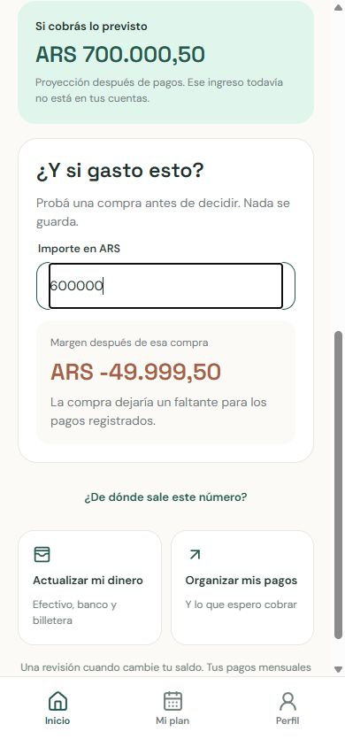
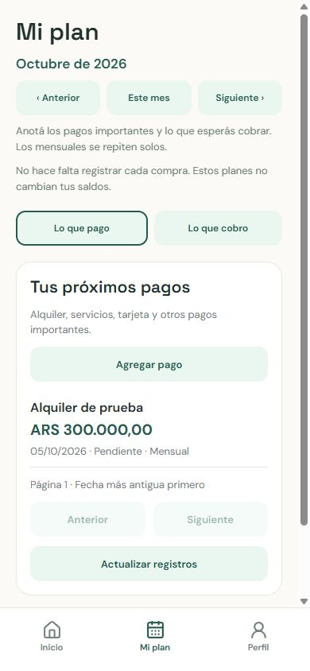

# Simpler month experience validation

Validated 2026-10-01 with synthetic data only.

The product now opens with a cash-flow answer instead of an account list. Inicio
shows current liquid cash minus pending bills through month end and a separate
expected-income forecast. The first-use state guides balances then major bills.
An extra-purchase preview runs without saving data. Mi plan separates payments
and income, offers familiar presets and keeps monthly recurrence. Mi dinero
prioritizes cash, bank and wallet, with additional types behind a disclosure.
Navigation contains Inicio, Mi plan and Perfil, hiding unfinished features.

## Financial and technical checks

- 179 backend tests passed, 98% branch-inclusive coverage. Ruff lint/format and
  mypy (59 source files) passed.
- 22 mobile tests passed, Expo lint and TypeScript passed.
- Domain checks cover currency separation, zero, deficits, exact maximum Decimal
  precision, negative and unavailable balances, overdue income and month bounds.
- API checks cover ownership, archive exclusion, all 55 bills beyond list-page
  limits, unchanged account snapshots, repeated reads and monthly rollover.
- Preview checks cover zero/negative/ambiguous input, exact cents, maximum values
  and shortfalls; there is no financial write path in the preview.
- Docker backend rebuilt without deleting data. LAN /ready returns ready and
  /api/v1/home appears in OpenAPI; unauthenticated access returns 401.

## Visual checks

Browser at 390 × 844: empty setup, account link, populated summary, purchase
shortfall, currency selector, payment/income navigation and monthly presets.
Synthetic ARS 850000.50 cash minus 300000.00 rent produces 550000.50 margin;
150000.00 expected income produces a separate 700000.50 forecast. A hypothetical
600000.00 purchase produces -49999.50 without changing saved records.

## Product limits

This is a limited diagnostic, not the full safe-to-spend formula. Daily budgets,
goal reserves and contributions remain excluded and are disclosed beside the
result. Received/paid states and stopping/editing monthly repetitions remain the
next priority before routine use beyond testing. No new dependencies or database
migrations were introduced. Native physical-device interaction was not verified;
Expo Go should be reloaded to inspect the changes. Existing pytest cache and Node
module-type warnings did not fail tests. Synthetic fixtures were removed only
from the named test database; temporary servers were stopped.
